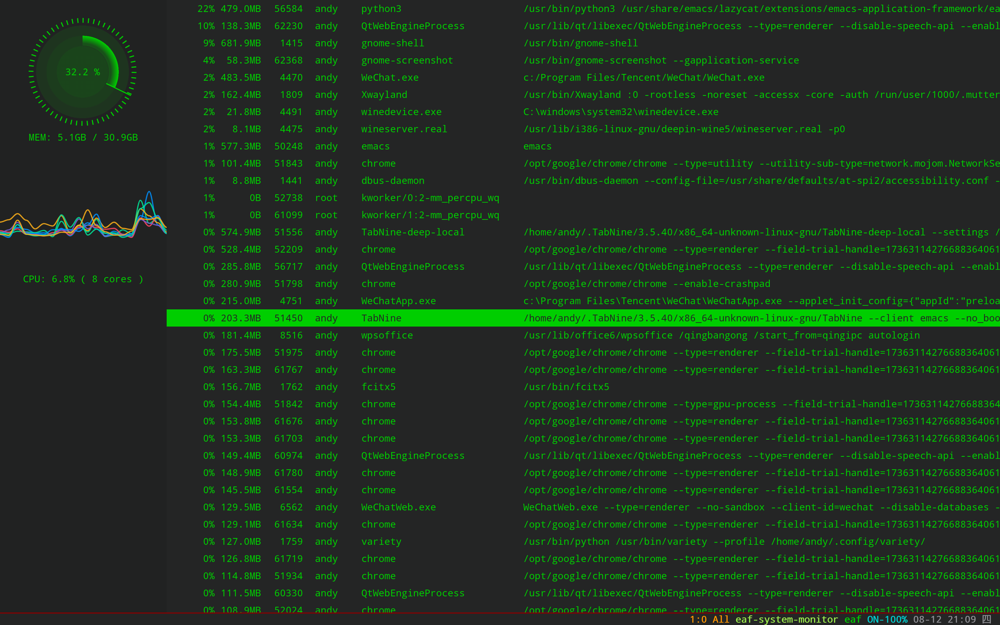

### EAF System Monitor
<p align="center">
  
</p>

System Monitor application for the [Emacs Application Framework](https://github.com/emacs-eaf/emacs-application-framework).

### Load application

```Elisp
(add-to-list 'load-path "~/.emacs.d/site-lisp/eaf-system-monitor/")
(require 'eaf-system-monitor)
```

### Dependency List

| Package       | Description                                                        |
| :--------     | :------                                                            |
| python-psutil | Retrieving information on running processes and system utilization |

### The keybinding of EAF System Monitor.

| Key   | Event   |
| :---- | :------ |
| `<f12>` | open_devtools |
| `C-n` | js_scroll_up |
| `C-p` | js_scroll_down |
| `C-v` | js_scroll_up_page |
| `M-v` | js_scroll_down_page |
| `M-<` | js_scroll_to_begin |
| `M->` | js_scroll_to_bottom |

